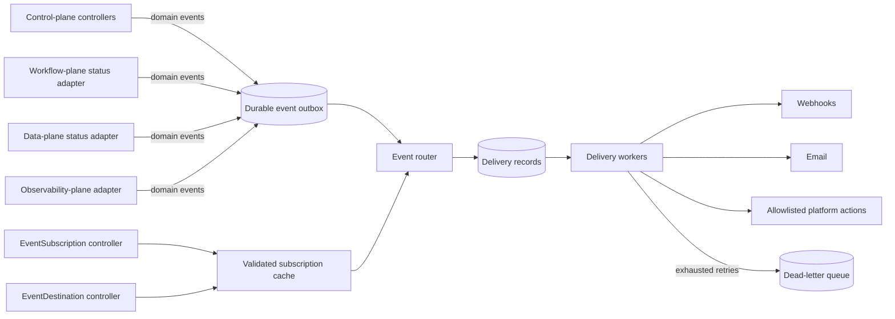
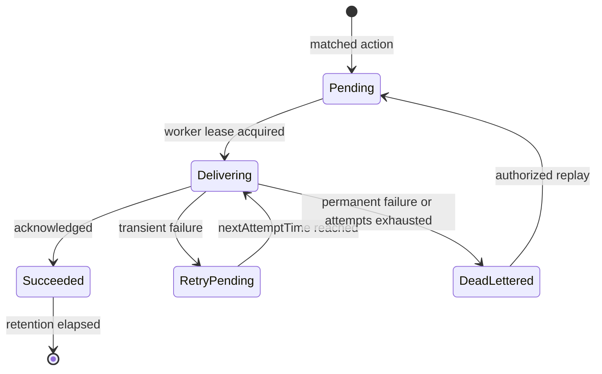

# OpenChoreo lifecycle events and automation

**Authors**:  
_TBD_

**Reviewers**:  
_TBD_

**Created Date**:  
2026-07-01

**Status**:  
Draft

**Related Issues/PRs**:  
_TBD_

---

## Summary

OpenChoreo should provide a stable domain-event API with:

1. An `EventSubscription` CRD for selecting events and declaring actions.
2. An `EventDestination` CRD for reusable webhook and email configuration.
3. Event producers in the controllers that own each lifecycle transition.
4. A dedicated eventing service that matches, persists, retries, and audits deliveries.
5. CloudEvents 1.0 envelopes and at-least-once delivery semantics.

The existing `event-forwarder` should not become this API without substantial changes. It is deliberately a lossy, best-effort catalog invalidation mechanism: it debounces updates, drops events when its in-memory queue is full, and normally attempts delivery once because Backstage performs a periodic full reconciliation. Those are valid trade-offs for catalog refreshes, but not for user notifications or automation.

Argo Events can be used behind the OpenChoreo API as an optional implementation of transport and actions. OpenChoreo should not expose Argo `EventSource` and `Sensor` resources as its public contract. Raw resource watches do not provide stable domain semantics, and direct Kubernetes-object triggers grant more power than most subscribers need.

## Motivation

OpenChoreo controllers currently expose desired and observed state through Kubernetes resources, but there is no supported way for a user to subscribe to meaningful lifecycle transitions. Integrations must poll resources, consume internal Kubernetes updates, modify controllers, or deploy an unrelated automation system.

This affects several distinct workflows:

- A platform team wants to build a component after it is created.
- A development team wants an email when a build fails.
- An incident system needs a webhook when a deployment becomes unhealthy.
- A governance system needs to know when projects are created, optionally only when attributes match a predicate.

The current `event-forwarder` does not satisfy these requirements. Its messages are hints that tell Backstage to refetch current state, and missed messages are repaired by periodic catalog synchronization. User automation has side effects and therefore requires stable domain semantics, durable state, authorization, retry, deduplication, and an auditable outcome.

## Goals

- Notify users and external systems about meaningful OpenChoreo lifecycle transitions.
- Trigger a small, explicitly supported set of platform actions.
- Filter by event type and tenant-visible attributes such as project, component, environment, and name.
- Work for events originating in the control plane, workflow plane, observability plane, or data plane.
- Survive process restarts and temporary destination outages.
- Preserve tenant isolation and avoid leaking secrets or internal resource state.
- Give operators delivery status, retry, dead-letter, and replay controls.

## Non-goals

- Replacing logs, metrics, traces, or observability alert evaluation.
- Exposing every Kubernetes `ADDED`, `MODIFIED`, or `DELETED` notification to users.
- Providing exactly-once side effects. HTTP, email, and Kubernetes APIs cannot guarantee that end to end.
- Allowing arbitrary Kubernetes objects or shell commands as user-defined actions in the first version.
- Building a general-purpose, high-volume streaming platform.

## Impact

- **API**: Introduces the namespaced `EventSubscription` and `EventDestination` CRDs and corresponding OpenChoreo API endpoints.
- **Domain controllers**: Project, Component, WorkflowRun, and deployment-status reconcilers emit sanitized domain events through a shared producer library.
- **Control plane**: Adds an eventing deployment containing subscription reconciliation, routing, and delivery workers, plus internal durable records.
- **Remote planes**: Workflow, data, and observability plane adapters must report relevant authoritative transitions to the control plane.
- **RBAC and authorization**: Adds permissions for event configuration and narrowly scoped execution of supported actions.
- **CLI and UI**: May add subscription, destination, delivery-status, dead-letter, and replay operations.
- **Operations**: Adds retained event/delivery objects, egress traffic, metrics, alerts, and capacity planning.
- **Compatibility**: Existing CRDs and the Backstage `event-forwarder` remain unchanged. The new API is additive.
- **Migration**: No migration is needed initially. Reuse of observability notification channels is explicitly deferred.

## Design

### Decisions

| Question | Decision |
| --- | --- |
| Do we need a new public CRD? | Yes. Add `EventSubscription`; add `EventDestination` to separate reusable credentials and delivery policy from matching rules. |
| Where are events detected? | In the controller or plane adapter that owns the domain transition. |
| Controller or service? | Both: controllers reconcile configuration and produce events; asynchronous service workers route and deliver them. |
| Can the current event-forwarder be reused? | Keep its catalog path unchanged. Reuse only generic libraries after separating its lossy semantics. |
| Is Argo Events required? | No. It is an optional internal adapter, not the public API or mandatory runtime. |
| Can observability channels be reused? | Not unchanged. Share low-level delivery code and consider a later generic channel migration. |
| Delivery guarantee | At least once, with stable event IDs, durable retry state, dead-lettering, and consumer deduplication. |

### Use cases and event catalog

| Requirement | Proposed event | Typical action |
| --- | --- | --- |
| A component is created | `dev.openchoreo.component.created.v1` | Start the component's configured build workflow |
| A build fails | `dev.openchoreo.workflowrun.failed.v1` | Send a webhook or email |
| A deployed workload becomes unhealthy | `dev.openchoreo.deployment.degraded.v1` | Send a webhook to an incident system |
| A project is created | `dev.openchoreo.project.created.v1` | Send a webhook |
| A project with a particular name is created | Same project event plus a CEL filter | Send a webhook |

The event catalog should be explicit and versioned. Adding `*.updated` as a catch-all would recreate the ambiguity of Kubernetes watches; prefer events such as `deployment.degraded`, `deployment.recovered`, and `workflowrun.failed` whose transition rules are documented.

### Why Kubernetes watches are not the event contract

Kubernetes watches are an efficient input mechanism, but they are not a durable domain-event log:

- An informer's initial list invokes add handlers for resources that already exist. A process restart must not turn those into new `*.created` events.
- Several changes may be coalesced into one update, and a relist may produce an update even when the object did not change.
- A watch reports object mutations, not intent. A `WorkflowRun` update is not inherently a build failure; the relevant transition is a specific condition becoming true.
- Watch history is bounded by the API server's retained `resourceVersion` history.
- Raw objects expose internal fields and make subscribers dependent on CRD representation.

The owning controller has the context needed to emit a domain event once a transition is authoritative. A shared producer library should create an immutable, durable event record using a deterministic event ID. Reconciliation can safely retry creation of the same record.

Examples:

- The Component controller emits `component.created` only after creation has been accepted and the initial reconciliation milestone is reached.
- The WorkflowRun controller emits `workflowrun.failed` when `WorkflowFailed` changes to `True`, not on every later status update.
- The deployment status reconciler emits `deployment.degraded` and `deployment.recovered` on health transitions reported from the data plane.

### Event envelope

Use the CloudEvents 1.0 JSON format. It is transport-neutral, supported by Argo Events, and supplies the identity fields needed for deduplication.

```json
{
  "specversion": "1.0",
  "id": "evt-7e2f8a4c...",
  "source": "https://api.openchoreo.dev/organizations/acme",
  "type": "dev.openchoreo.workflowrun.failed.v1",
  "subject": "projects/shop/components/checkout/workflow-runs/build-7f5d",
  "time": "2026-07-01T09:40:31Z",
  "datacontenttype": "application/json",
  "data": {
    "organization": "acme",
    "project": "shop",
    "component": "checkout",
    "workflowRun": "build-7f5d",
    "workflow": "docker-build",
    "reason": "WorkflowFailed",
    "message": "build task exited with status 1"
  }
}
```

Rules for the envelope:

- `id` is globally unique and stable across producer and delivery retries. A deterministic ID can be derived from the resource UID, event type, and an authoritative transition marker.
- `type` is a versioned OpenChoreo event type, not a Go type or Kubernetes kind.
- `source` identifies the OpenChoreo installation and organization.
- `subject` identifies the affected domain resource.
- `data` contains an allowlisted, versioned payload. Do not copy a complete CR into it.
- Secret values, repository credentials, webhook headers, and arbitrary status details are excluded.
- Correlation identifiers and W3C `traceparent` may be added as CloudEvents extension attributes.

Consumers must deduplicate on `(source, id)`. Ordering is guaranteed only where explicitly documented; subscribers should not assume global ordering.

### Public API

#### EventSubscription

`EventSubscription` is namespaced to the organization. It selects one or more event types, applies an optional CEL predicate, and declares one or more bounded actions.

```yaml
apiVersion: openchoreo.dev/v1alpha1
kind: EventSubscription
metadata:
  name: failed-build-notifications
  namespace: acme
spec:
  eventTypes:
    - dev.openchoreo.workflowrun.failed.v1
  filter: >-
    event.data.project == "shop" &&
    event.data.component == "checkout"
  actions:
    - name: notify-ci-system
      destinationRef:
        name: ci-system
status:
  observedGeneration: 1
  conditions:
    - type: Ready
      status: "True"
      reason: Valid
```

A name-specific project subscription is then straightforward:

```yaml
apiVersion: openchoreo.dev/v1alpha1
kind: EventSubscription
metadata:
  name: payments-project-created
  namespace: acme
spec:
  eventTypes:
    - dev.openchoreo.project.created.v1
  filter: event.data.project == "payments"
  actions:
    - name: notify-governance
      destinationRef:
        name: governance-webhook
```

CEL is a good fit because OpenChoreo already uses it for validation and templating. The expression should receive only the documented event envelope, be type-checked where an event schema is available, and have evaluation cost limits. Filters must not fetch other resources or perform network calls.

API invariants:

- `eventTypes` has at least one entry and accepts only event types registered in the OpenChoreo event catalog.
- Each action has a unique name and sets exactly one of `destinationRef` or a supported internal action.
- `destinationRef` resolves only within the subscription namespace.
- A subscription generation is eligible only for events created after that generation becomes `Ready`. Router retries therefore cannot make a new subscription consume historical events accidentally.
- `status.observedGeneration` and a `Ready` condition report whether all types, filters, actions, and references are valid.
- Delivery counts are metrics or separate delivery API data, not subscription status fields, to avoid high-frequency status writes.

#### EventDestination

`EventDestination` holds reusable delivery configuration. Authentication values are always referenced from Secrets.

```yaml
apiVersion: openchoreo.dev/v1alpha1
kind: EventDestination
metadata:
  name: ci-system
  namespace: acme
spec:
  webhook:
    url: https://ci.example.com/hooks/openchoreo
    headers:
      Authorization:
        valueFrom:
          secretKeyRef:
            name: ci-webhook-credentials
            key: authorization
    timeout: 10s
  delivery:
    maxAttempts: 8
    initialBackoff: 2s
    maxBackoff: 10m
```

Email can be another mutually exclusive destination type. Templates should receive the generic `event` object. Validate rendered payload size and header names, and restrict outbound destinations according to platform egress policy.

`EventDestination` must set exactly one destination type. Its `Ready` condition confirms structural validation and Secret availability, but it must not make an outbound request during reconciliation. Pending retries use the latest ready destination generation. This lets an operator repair a URL or rotate credentials without replaying every delivery. The delivery audit record stores the generation used by each attempt.

#### Internal automation actions

An event subscription may also request an allowlisted OpenChoreo action, for example creating a `WorkflowRun` from the component's configured workflow:

```yaml
spec:
  eventTypes:
    - dev.openchoreo.component.created.v1
  filter: event.data.project == "shop"
  actions:
    - name: build-component
      workflowRun:
        useComponentWorkflow: true
```

The eventing service must authorize the action as the subscription owner and add the source event ID to the created resource. A deterministic resource name or idempotency annotation prevents duplicate runs when the event is redelivered. Do not expose Argo's generic Kubernetes object trigger directly to tenants.

### Architecture



#### Responsibilities

**Domain controllers and plane adapters**

- Detect authoritative lifecycle transitions.
- Build sanitized, versioned CloudEvents.
- Persist events using deterministic IDs so reconcile retries are idempotent.
- Never perform user webhook or email delivery inside a domain reconcile loop.

**EventSubscription and EventDestination controllers**

- Validate references, CEL filters, templates, secret access, and tenant scope.
- Publish readiness and validation failures through status conditions.
- Maintain a compiled subscription cache for the router.

**Eventing service**

- Read durable event records, match subscriptions, and create one delivery record per action.
- Run bounded worker pools with per-destination concurrency and rate limits.
- Retry transient failures with exponential backoff and jitter.
- Treat non-retryable 4xx responses separately from 408, 429, and 5xx responses.
- Move exhausted deliveries to a dead-letter state and support authorized replay.
- Expose metrics and structured logs without logging secret values or full sensitive payloads.

The controllers and workers can initially run in one deployment, but they are different responsibilities. Delivery must remain asynchronous so an unavailable SMTP or webhook endpoint cannot block OpenChoreo reconciliation.

#### Event production protocol

Producing an event and updating a domain resource are separate Kubernetes writes. The owning reconciler therefore follows an idempotent protocol:

1. Determine the authoritative transition from current domain state.
2. Derive an event ID from the resource UID, event type, and transition identity. For a condition transition, the identity includes the condition's observed generation and transition time.
3. Create the immutable internal event record.
4. Treat `AlreadyExists` as success.
5. Requeue on any other write failure. A later reconcile derives the same ID and retries.

The event write must happen before the controller considers event publication complete. It must not call destinations directly. Producers for remote planes use the same protocol after the authoritative status has been projected into the control plane.

Creation semantics must be defined per resource. The initial catalog defines `*.created` as successful API persistence; a separate future `*.ready` event represents successful reconciliation. The owning controller publishes `created` when it first observes the object, but uses the object's `creationTimestamp` as the event occurrence time. To prevent an upgrade from publishing creation events for every existing object, the installation records an eventing activation timestamp and producers emit `created` only for objects created at or after that point. Restarts keep the same activation timestamp.

### Persistence and delivery semantics

The required contract is **at least once**:

- An accepted event is durably stored before delivery.
- A successful delivery may be repeated if the worker crashes after the destination processes it but before the acknowledgement is stored.
- Webhook consumers deduplicate by CloudEvent `id`.
- Email can occasionally be duplicated; this limitation must be documented.
- Events for different subjects may be delivered out of order.

For an initial low-volume lifecycle implementation, immutable internal event and delivery CRs with TTL cleanup are a pragmatic outbox. They provide Kubernetes-native persistence and reconciliation without requiring another distributed system. They must not be public APIs, and etcd object count, write rate, and payload size must be measured.

The internal records have these responsibilities:

| Record | Immutable identity | Mutable state |
| --- | --- | --- |
| `PlatformEvent` | CloudEvent envelope, producer, creation time | Expiry only |
| `EventDelivery` | Event ID, subscription UID/generation, action, destination reference | Phase, attempt count, destination generation used per attempt, next attempt time, last sanitized error, completion time |

These are implementation CRDs installed in an OpenChoreo system namespace and hidden from normal tenant RBAC. They are not a supported integration API. A garbage-collection controller removes completed records after the configured retention period; pending and dead-letter records are never removed by the normal completion TTL.



Workers claim deliveries with optimistic concurrency and a bounded lease. If a worker dies, another worker may redeliver after the lease expires. This is the source of the documented at-least-once behavior.

Routing is also idempotent. A delivery ID is derived from the event ID, subscription UID, eligible subscription generation, and action name. If the router crashes after creating only some deliveries, its next reconcile recreates the same set and treats `AlreadyExists` as success. Deleting a subscription stops new matches but does not cancel already materialized deliveries; cancellation, if needed later, must be an explicit operation.

If volume or retention outgrows that model, place the same producer/router interfaces over NATS JetStream or Kafka. The public CRDs and CloudEvents schema do not need to change.

Suggested operational signals:

- `events_produced_total{type}`
- `event_deliveries_total{destination,result}`
- `event_delivery_attempts_total{destination}`
- `event_delivery_latency_seconds`
- `event_delivery_queue_depth`
- `event_dead_letter_total{destination}`
- oldest pending delivery age

### Relationship to the existing event-forwarder

The current implementation in `internal/eventforwarder` watches a fixed list of resources and emits this payload:

```json
{"kind":"Project","name":"shop","namespace":"acme","action":"updated"}
```

It is optimized to tell Backstage to refetch current state. Its queue is in memory, update events are debounced, a full queue drops new events, and the default endpoint has no retry. Backstage's periodic full sync is the recovery path.

Keep this path for catalog invalidation. Reuse generic implementation pieces only after separating them from its semantics—for example HTTP client hardening, health probes, and worker-pool patterns. Do not send user-facing lifecycle events through its current queue or payload.

### Relationship to observability alerts

Observability alerting and lifecycle eventing have different producers and evaluation models:

| Concern | Observability alerting | Lifecycle eventing |
| --- | --- | --- |
| Input | Logs, metrics, or budgets over time in the current alert API | Discrete OpenChoreo domain transitions |
| Evaluation | Query + window + threshold | Event type + optional CEL predicate |
| State | Firing/resolved alert state | Immutable event occurrence |
| Examples | Error rate above 5% for 10 minutes | Workflow run changed to failed |
| Primary owner | Observability plane | Owning domain controller or plane adapter |

`ObservabilityAlertsNotificationChannel` should not be reused unchanged. It is environment-scoped and its templates are coupled to alert fields. The eventing implementation may share low-level SMTP/webhook delivery libraries with it. A later proposal may introduce a generic `NotificationChannel` used by both systems, but that migration should not make alert-specific concepts part of the lifecycle event API.

### Argo Events assessment

Argo Events supplies useful building blocks:

- Resource event sources can watch CRDs and select `ADD`, `UPDATE`, or `DELETE`.
- Sensors provide data filters and HTTP, Slack, Kafka, NATS, Kubernetes-object, and Argo Workflow triggers.
- The EventBus supports NATS JetStream and Kafka; JetStream sensors use durable consumers.
- Triggers support retry, rate limiting, at-least-once mode, and a dead-letter trigger.
- Resource event sources support active-passive high availability.

However, using Argo resources directly does not solve the main product problems:

- A raw resource `UPDATE` is not a stable OpenChoreo lifecycle event.
- Resource bodies expose internal API shape and potentially sensitive fields.
- Email is not a first-class trigger.
- Generic Kubernetes-object triggers create a broad RBAC and privilege-escalation surface.
- The EventBus is namespaced, while OpenChoreo events cross control, workflow, observability, and data planes.
- Argo creates operational overhead: controllers, an EventBus, and deployments for EventSources and Sensors.
- Public Argo CRDs would couple the OpenChoreo API and upgrade policy to an implementation dependency.

Decision: **do not expose Argo Events as the OpenChoreo event API**. If an installation already operates Argo Events, an internal adapter may publish OpenChoreo CloudEvents to an Argo EventBus and compile supported subscription actions to Sensors. OpenChoreo must still own event production, schemas, authorization, and public CRDs.

### Security and tenancy

- Namespace scope limits a subscription to events in its organization. Cross-organization subscriptions require an explicit cluster-level administrative API.
- Validate every destination reference in the same namespace and authorize Secret reads narrowly.
- Enforce HTTPS by default; permit plain HTTP only for explicitly allowed in-cluster services.
- Protect against SSRF by applying egress policy and blocking link-local, metadata-service, loopback, and disallowed private addresses where appropriate.
- Sign webhooks with an HMAC over the raw body and timestamp; support secret rotation.
- Redact destination credentials and sensitive event fields from status, logs, and metrics.
- Apply payload-size, template-cost, retry, concurrency, and per-tenant rate limits.
- Record subscription changes, delivery outcomes, replays, and automation actions in an audit trail.
- Evaluate internal actions using the requesting principal's permissions or a constrained delegated policy, not unrestricted controller credentials.

### Failure handling

| Failure | Behavior |
| --- | --- |
| Destination timeout, 408, 429, or 5xx | Retry with exponential backoff and jitter |
| Permanent 4xx | Mark failed without repeated retries, except configured retryable codes |
| Eventing service restart | Resume pending deliveries from durable state |
| Duplicate event production | Deterministic event ID collapses duplicate records |
| Duplicate delivery | Consumer deduplicates by CloudEvent ID; internal actions use deterministic names |
| Invalid filter or missing destination | Subscription remains `Ready=False`; no deliveries are attempted |
| Retries exhausted | Move to dead-letter state, alert the operator, allow audited replay |
| Plane temporarily disconnected | Plane adapter buffers or reconstructs the transition, then publishes on reconnect |

Deletion events need special treatment. If they are required, the owning controller needs a finalizer or another durable pre-delete record; an informer delete callback alone cannot guarantee emission. Deletion events should be deferred until a concrete product use case justifies that lifecycle cost.

## Alternatives considered

| Alternative | Decision | Reason |
| --- | --- | --- |
| Extend `event-forwarder` configuration with user endpoints | Rejected as the product API | It has lossy delivery semantics, raw resource actions, static Helm configuration, and no tenant authorization or durable replay. |
| Expose Argo `EventSource` and `Sensor` CRDs | Rejected | It couples the public API to Argo, exposes internal resource shapes, and makes safe multi-tenant action authorization difficult. |
| Compile OpenChoreo CRs to Argo resources internally | Deferred option | Viable after OpenChoreo owns event production and schemas; it does not remove the need for the proposed public API. |
| Reuse `ObservabilityAlertsNotificationChannel` directly | Rejected | Its scope, payload variables, and lifecycle are alert-specific. Shared transport code is still desirable. |
| Put destinations inline in every subscription | Rejected | It duplicates credentials and retry policy and makes rotation harder. A destination reference provides a stable reuse and authorization boundary. |
| Install JetStream or Kafka in the first release | Deferred | The initial event class is low volume. Kubernetes-backed records reduce initial operational cost and preserve an adapter boundary for later migration. |
| Use Kubernetes audit events as the source | Rejected | Audit events describe API requests and actors, not successful domain transitions such as workflow failure or deployment degradation. |

## Rollout plan

### Phase 1: event contract and reliable webhooks

- Define the event catalog and JSON schemas for project creation, component creation, workflow failure, and deployment degradation/recovery.
- Add `EventSubscription` and webhook-only `EventDestination` CRDs.
- Add the producer library and internal durable event/delivery records.
- Emit events from the Project, Component, WorkflowRun, and deployment status controllers.
- Implement CEL filtering, retries, dead-letter status, replay, HMAC signing, metrics, and audit logs.
- Load-test event and delivery CR churn before selecting TTL defaults.

### Phase 2: email and internal automation

- Add email destinations using a shared delivery library.
- Add the allowlisted `WorkflowRun` action with idempotency and authorization checks.
- Add per-tenant quotas and destination rate limits.

### Phase 3: scale and integrations

- Add an optional JetStream or Kafka persistence adapter if measured volume requires it.
- Add an optional Argo Events adapter for installations that need its broader trigger ecosystem.
- Consider a generic notification-channel API shared with observability through a separate migration proposal.

## Acceptance criteria

- Restarting an informer or eventing pod does not emit false `*.created` events.
- A `WorkflowRun` produces one logical failed event when its failure condition transitions to true.
- A temporary webhook outage is retried after all OpenChoreo processes restart.
- Redelivery retains the same CloudEvent ID.
- Replaying a delivery is visible in audit data and does not create a duplicate internal workflow run.
- A tenant cannot subscribe to another tenant's events or reference its Secrets.
- Event payloads contain no complete CRs or credentials.
- Delivery failures do not block domain controller reconcile loops.
- The Backstage event-forwarder continues to operate independently.

## Open questions

1. Which controller owns the canonical `deployment.degraded` transition when status is aggregated across a remote data plane?
2. What lifecycle event retention and dead-letter retention are required?
3. Should project/component creation mean API persistence, successful initial reconciliation, or readiness? The event name or payload must make that milestone unambiguous.
4. Which workflow may a component-created subscription invoke, and who is authorized to configure it?
5. Is webhook delivery required across disconnected or air-gapped planes, and where should buffering occur?
6. What measured event rate should trigger migration from Kubernetes-backed records to a broker?

## References

- [Kubernetes API concepts: watch, list, and resource versions](https://kubernetes.io/docs/reference/using-api/api-concepts/)
- [client-go cache handler semantics](https://pkg.go.dev/k8s.io/client-go/tools/cache#ResourceEventHandler)
- [CloudEvents specification](https://github.com/cloudevents/spec/tree/ce@v1.0.2)
- [Argo Events architecture](https://argoproj.github.io/argo-events/concepts/architecture/)
- [Argo Events resource event source](https://argoproj.github.io/argo-events/eventsources/setup/resource/)
- [Argo Events EventBus](https://argoproj.github.io/argo-events/eventbus/eventbus/)
- [Argo Events JetStream EventBus](https://argoproj.github.io/argo-events/eventbus/jetstream/)
- [Argo Events sensors and trigger delivery behavior](https://argoproj.github.io/argo-events/sensors/more-about-sensors-and-triggers/)
- [Argo Events HTTP trigger](https://argoproj.github.io/argo-events/sensors/triggers/http-trigger/)
- [Argo Events EventSource high availability](https://argoproj.github.io/argo-events/eventsources/ha/)
