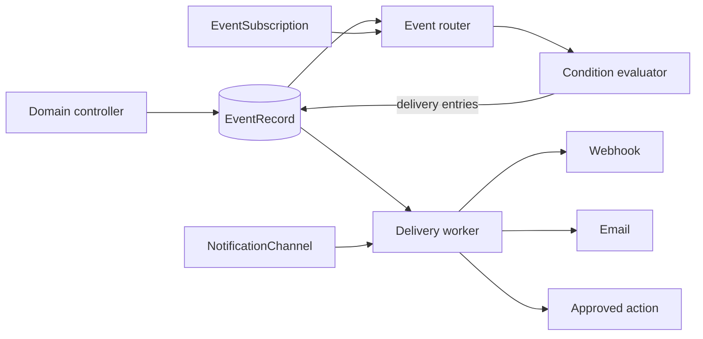

# How OpenChoreo lifecycle events work

This document explains the proposed event system in practical terms. The resource names and fields shown here are proposed APIs, not currently implemented APIs.

## The basic idea

Users describe two things:

1. **When** something interesting happens, such as a component being created or a build failing.
2. **What to do**, such as call a webhook, send an email, or start a build.

An `EventSubscription` connects the **when** to the **what**.

```text
Something happens
       |
       v
OpenChoreo records an event
       |
       v
Matching EventSubscriptions are found
       |
       v
Webhook, email, or an approved OpenChoreo action runs
```

For example:

```yaml
apiVersion: openchoreo.dev/v1alpha1
kind: EventSubscription
metadata:
  name: notify-when-build-fails
  namespace: acme
spec:
  eventTypes:
    - dev.openchoreo.workflowrun.failed.v1
  actions:
    - name: notify-team
      channelRef:
        name: team-webhook
```

This means: “Whenever a build fails in the `acme` organization, deliver the event through `team-webhook`.”

## Main resources

### EventSubscription

An `EventSubscription` defines:

- The event types to listen for.
- Optional structured matches, such as project or environment.
- An optional CEL expression for more advanced filtering.
- One or more actions.

Common structured matches are:

```yaml
match:
  resourceNames: [payments]
  projects: [online-store]
  components: [checkout]
  environments: [production]
```

Values in the same list are OR-ed. Different populated fields are AND-ed.

For example, this matches `checkout` or `cart`, but only in `production`:

```yaml
match:
  components: [checkout, cart]
  environments: [production]
```

### NotificationChannel

A `NotificationChannel` describes how to contact an external destination. It contains reusable connection information such as:

- Webhook URL and authentication headers.
- Email recipients and SMTP configuration.
- Message templates.
- Timeout and retry policy.

Credentials are read from Kubernetes Secrets. They are not placed directly in the channel or event.

### Internal EventRecord

OpenChoreo uses one private CRD that normal users do not manage:

- `EventRecord.spec` stores the durable CloudEvent—the fact that something happened.
- `EventRecord.status.deliveries` stores the actions, attempts, retries, and outcomes for that event.

There is one `EventRecord` object per event even when several subscriptions receive it. Stateful counts are rebuilt from recent records rather than creating another object for every subscription group. This keeps the design lightweight while allowing delivery to continue after restarts.

## Who captures events?

The controller that owns a lifecycle transition captures it.

| Event | Producer |
| --- | --- |
| Project created | Project controller |
| Component created | Component controller |
| Build failed | WorkflowRun controller |
| Deployment became unhealthy | Deployment/ReleaseBinding status controller after receiving data-plane health |

This is more reliable than watching every Kubernetes update in one central process. The owning controller knows the difference between an ordinary status update and an actual transition such as “running to failed.”

Examples:

- The WorkflowRun controller records `workflowrun.failed` only when the failure condition becomes true.
- Later updates to the same failed WorkflowRun do not create another logical failure event.
- The deployment status controller records `deployment.degraded` when health changes from healthy to degraded.
- It records a separate `deployment.recovered` event if the deployment becomes healthy again.

Each event receives a deterministic ID based on the affected resource and transition. If a controller retries after a crash, it attempts to create the same event rather than a duplicate event.

## How an event is sent

Consider a failed build.

1. The WorkflowRun controller observes the failure condition.
2. It writes a private `EventRecord` containing a sanitized CloudEvent.
3. The event router finds subscriptions for `dev.openchoreo.workflowrun.failed.v1`.
4. It applies structured matches and then any CEL filter.
5. If the subscription has a count condition, the condition evaluator updates its in-memory window reconstructed from retained records. A subscription without a condition passes immediately.
6. When the subscription triggers, OpenChoreo adds a delivery entry to `EventRecord.status` for every action.
7. A delivery worker claims the delivery entry.
8. The worker resolves the referenced `NotificationChannel` or approved internal action.
9. It sends the webhook/email or creates the requested OpenChoreo resource.
10. It marks the delivery successful, schedules a retry, or moves it to dead-letter state.



Domain controllers never wait for a webhook or mail server. External delivery happens asynchronously, so a slow external system cannot block project, component, build, or deployment reconciliation.

## What is sent to a webhook?

Without a custom payload template, a lifecycle webhook receives a CloudEvents 1.0 JSON document:

```json
{
  "specversion": "1.0",
  "id": "evt-7e2f8a4c...",
  "source": "https://api.openchoreo.dev/organizations/acme",
  "type": "dev.openchoreo.workflowrun.failed.v1",
  "subject": "projects/store/components/checkout/workflow-runs/build-7f5d",
  "time": "2026-07-01T09:40:31Z",
  "datacontenttype": "application/json",
  "data": {
    "organization": "acme",
    "resourceName": "build-7f5d",
    "project": "store",
    "component": "checkout",
    "workflowRun": "build-7f5d",
    "reason": "WorkflowFailed",
    "message": "build task exited with status 1"
  }
}
```

The payload contains only documented fields. It does not contain a complete Kubernetes resource, credentials, or secret values.

Webhook consumers should store the `(source, id)` pair and ignore a repeated event with the same pair.

## Do we need a controller or service?

Yes. There are three responsibilities:

1. **Existing domain controllers produce events.** Project, Component, WorkflowRun, and deployment controllers detect authoritative transitions.
2. **New controller-manager reconcilers validate resources.** They reconcile `EventSubscription` and `NotificationChannel`, validate references and filters, and publish `Ready` conditions.
3. **A controller-manager event module routes and delivers events.** It runs the router and bounded asynchronous delivery workers.

No new deployment is required by default. The event module runs in the existing controller-manager but uses separate queues, strict timeouts, and a bounded worker pool, so it never performs network delivery inside a domain reconcile call. Large installations may optionally disable these workers in the controller-manager and run the same module as a separate deployment.

Argo Events is not required. An Argo Events adapter could be added later without changing the OpenChoreo APIs shown here.

The existing Backstage `event-forwarder` remains separate because it intentionally drops messages under sustained load and relies on Backstage's periodic full synchronization. That behavior is unsuitable for user automation.

### Default footprint

| Item | Default cost |
| --- | --- |
| New deployments | 0 |
| New pods | 0 |
| Public CRDs | 2: `EventSubscription` and `NotificationChannel` |
| Private CRDs | 1: `EventRecord` |
| Message broker | None |
| Objects per event | 1 `EventRecord` with bounded delivery entries |
| Objects per count group | 0; counts rebuild from retained events |

It is possible to reduce the public API to one CRD by putting webhook/email configuration directly inside every subscription. That is not recommended: credentials and retry policy would be duplicated, rotation would require editing many subscriptions, and observability could not share channels cleanly. Two public CRDs plus one private record CRD is the lightweight clean boundary.

## Delivery behavior

The system provides **at-least-once delivery**:

- A temporary timeout, HTTP 408, HTTP 429, or server error is retried.
- Retries use exponential backoff and jitter.
- Pending work survives eventing pod restarts.
- Permanent failures and exhausted retries move to dead-letter state.
- An authorized operator can replay a dead-lettered delivery.
- A successful request may occasionally be repeated if the worker crashes before saving the acknowledgement.

Exactly-once side effects cannot be guaranteed for HTTP or email. Webhook receivers must deduplicate using the CloudEvent ID. Internal actions use deterministic Kubernetes resource names to avoid creating a duplicate workflow run.

## Can it count several events?

The basic examples below react to one event at a time. CEL can inspect one event, but it cannot remember earlier events. Therefore, CEL alone cannot implement “send an event if there are more than five build failures.”

The proposed stateful extension adds an optional count condition to `EventSubscription`:

```yaml
apiVersion: openchoreo.dev/v1alpha1
kind: EventSubscription
metadata:
  name: repeated-build-failures
  namespace: acme
spec:
  eventTypes:
    - dev.openchoreo.workflowrun.failed.v1
  match:
    environments: [production]
  condition:
    count:
      operator: gt
      threshold: 5
      window: 10m
      groupBy: [project, component]
    trigger:
      mode: thresholdCrossing
      cooldown: 30m
  actions:
    - name: notify-on-call
      channelRef:
        name: incident-webhook
```

In simple terms:

1. Every production build failure passes through the normal event filter.
2. OpenChoreo keeps a rolling ten-minute count for each project and component.
3. Counts for `store/checkout` and `store/cart` are independent.
4. The sixth `store/checkout` failure satisfies `count > 5`.
5. OpenChoreo creates one summary event and sends it to `incident-webhook`.
6. The seventh failure does not send another notification because the condition is already active.
7. The condition rearms after the count falls to five or fewer and the cooldown permits another trigger.

The delivered event summarizes the condition:

```json
{
  "specversion": "1.0",
  "type": "dev.openchoreo.subscription.triggered.v1",
  "data": {
    "subscription": "repeated-build-failures",
    "sourceEventType": "dev.openchoreo.workflowrun.failed.v1",
    "observedCount": 6,
    "operator": "gt",
    "threshold": 5,
    "window": "10m",
    "group": {
      "project": "store",
      "component": "checkout"
    }
  }
}
```

### Who keeps the count?

The controller-manager event module contains a condition evaluator. While running, it indexes recent retained `EventRecord` objects by:

- Subscription UID and generation.
- Project/component/environment group requested by `groupBy`.

After a restart or leader change, the evaluator lists recent `EventRecord` objects and rebuilds the rolling counts. It does not need an aggregation CR for every group. Duplicate CloudEvent IDs are discarded before counting, and derived threshold events restore cooldown state.

The count uses the time at which the control plane durably records the event. This gives deterministic results if a remote plane reconnects and reports delayed events.

### Other stateful scenarios

| Requirement | Can the proposed design handle it? | Approach |
| --- | --- | --- |
| More than five build failures in ten minutes | Yes, with the count extension | Count failures by project/component |
| Deployment degrades three times in thirty minutes | Yes, with the count extension | Count `deployment.degraded` by component/environment |
| More than twenty projects are created in an hour | Yes, with the count extension | Count `project.created` without a project group |
| Failures across the whole organization | Yes, with the count extension | Omit `groupBy` |
| Failures separately for every environment | Yes, with the count extension | Add `environment` to `groupBy` |
| Daily failure digest | Not in the count version | Needs batching and a scheduled flush |
| Failure percentage exceeds 20% | Not in the count version | Needs a ratio of failure and completion streams |
| Three distinct components fail | Not in the count version | Needs distinct-count state |
| Build fails, then no success occurs for thirty minutes | Not in the count version | Needs sequence matching and an absence timer |
| Release created, but deployment never becomes ready | Not in the count version | Needs correlation and a deadline timer |
| Deployment repeatedly degrades and recovers | Not in the count version | Needs ordered sequence/flapping detection |
| More than ten builds are currently running | Use current state or a metric | This is a gauge, not an event count |

The first stateful implementation should support only bounded sliding counts. Ratios, distinct counts, sequences, absence timers, and digests need separate designs. They can temporarily be implemented with observability rules, workflows, or an external event-processing system.

## Examples for the six scenarios

The examples assume all resources belong to the `acme` organization namespace.

### 1. Build a component after it is created

This subscription listens for component creation and asks OpenChoreo to create a `WorkflowRun` using the component's configured workflow.

```yaml
apiVersion: openchoreo.dev/v1alpha1
kind: EventSubscription
metadata:
  name: build-new-components
  namespace: acme
spec:
  eventTypes:
    - dev.openchoreo.component.created.v1
  actions:
    - name: start-build
      workflowRun:
        useComponentWorkflow: true
```

What happens:

1. The Component controller records `component.created`.
2. The router matches this subscription.
3. The delivery worker creates a `WorkflowRun` for that component.
4. The WorkflowRun name contains or is derived from the event ID, making the action idempotent.

This is an in-cluster action. It does not need a `NotificationChannel`.

### 2. Send a failed build to an external system

First, define the webhook channel:

```yaml
apiVersion: openchoreo.dev/v1alpha1
kind: NotificationChannel
metadata:
  name: ci-event-webhook
  namespace: acme
spec:
  webhook:
    url: https://ci.example.com/events/openchoreo
    headers:
      Authorization:
        valueFrom:
          secretKeyRef:
            name: ci-event-credentials
            key: authorization
    timeout: 10s
  delivery:
    maxAttempts: 8
    initialBackoff: 2s
    maxBackoff: 10m
```

Then subscribe to failed builds:

```yaml
apiVersion: openchoreo.dev/v1alpha1
kind: EventSubscription
metadata:
  name: export-failed-builds
  namespace: acme
spec:
  eventTypes:
    - dev.openchoreo.workflowrun.failed.v1
  actions:
    - name: export-event
      channelRef:
        name: ci-event-webhook
```

Because the webhook channel has no payload template, the external system receives the complete sanitized CloudEvent.

A Kafka, NATS, or other event bus can be reached through an organization's HTTP event gateway. A native bus channel can be added later without changing the subscription model.

### 3. Send an email when a build fails

Store SMTP credentials in a Secret:

```yaml
apiVersion: v1
kind: Secret
metadata:
  name: team-smtp-credentials
  namespace: acme
type: Opaque
stringData:
  username: notification-user
  password: replace-me
```

Define an email channel:

```yaml
apiVersion: openchoreo.dev/v1alpha1
kind: NotificationChannel
metadata:
  name: build-failure-email
  namespace: acme
spec:
  email:
    from: notifications@acme.example
    to:
      - platform-team@acme.example
    smtp:
      host: smtp.acme.example
      port: 587
      auth:
        username:
          secretKeyRef:
            name: team-smtp-credentials
            key: username
        password:
          secretKeyRef:
            name: team-smtp-credentials
            key: password
      tls:
        mode: required
    template:
      subject: "Build failed: ${notification.subject}"
      body: |
        ${notification.message}

        Project: ${notification.project}
        Component: ${notification.component}
        Time: ${notification.occurredAt}
  delivery:
    maxAttempts: 5
    initialBackoff: 5s
    maxBackoff: 5m
```

Subscribe to the event:

```yaml
apiVersion: openchoreo.dev/v1alpha1
kind: EventSubscription
metadata:
  name: email-failed-builds
  namespace: acme
spec:
  eventTypes:
    - dev.openchoreo.workflowrun.failed.v1
  actions:
    - name: email-platform-team
      channelRef:
        name: build-failure-email
```

The email worker renders the template with the normalized `notification` context and sends it through SMTP.

### 4. Page only when a production workload is unhealthy

Define a webhook channel for the incident system:

```yaml
apiVersion: openchoreo.dev/v1alpha1
kind: NotificationChannel
metadata:
  name: incident-webhook
  namespace: acme
spec:
  webhook:
    url: https://incidents.example.com/openchoreo
    timeout: 10s
    payloadTemplate: |
      {
        "title": "${notification.title}",
        "severity": "critical",
        "project": "${notification.project}",
        "component": "${notification.component}",
        "environment": "${notification.environment}"
      }
  delivery:
    maxAttempts: 10
    initialBackoff: 2s
    maxBackoff: 10m
```

Match only the production environment:

```yaml
apiVersion: openchoreo.dev/v1alpha1
kind: EventSubscription
metadata:
  name: page-production-degradation
  namespace: acme
spec:
  eventTypes:
    - dev.openchoreo.deployment.degraded.v1
  match:
    environments: [production]
  actions:
    - name: page-on-call
      channelRef:
        name: incident-webhook
```

A degradation in development or staging does not match. A degradation in production creates a delivery to the incident webhook.

### 5. Send every project-created event

Define a webhook channel with no template so it receives raw CloudEvents:

```yaml
apiVersion: openchoreo.dev/v1alpha1
kind: NotificationChannel
metadata:
  name: governance-events
  namespace: acme
spec:
  webhook:
    url: https://governance.example.com/events
    timeout: 10s
  delivery:
    maxAttempts: 8
    initialBackoff: 2s
    maxBackoff: 10m
```

Subscribe without a match or CEL filter:

```yaml
apiVersion: openchoreo.dev/v1alpha1
kind: EventSubscription
metadata:
  name: all-project-creations
  namespace: acme
spec:
  eventTypes:
    - dev.openchoreo.project.created.v1
  actions:
    - name: publish-project-event
      channelRef:
        name: governance-events
```

Every new project in `acme` matches. Projects in another organization namespace do not match because subscriptions are tenant-scoped.

### 6. Send project-created events only for a specific name

This example uses CEL as requested:

```yaml
apiVersion: openchoreo.dev/v1alpha1
kind: EventSubscription
metadata:
  name: payments-project-created
  namespace: acme
spec:
  eventTypes:
    - dev.openchoreo.project.created.v1
  filter: event.data.project == "payments"
  actions:
    - name: notify-governance
      channelRef:
        name: governance-events
```

The router first selects subscriptions for `project.created`, then evaluates the CEL expression. Only a project whose name is `payments` creates a delivery.

For a simple name equality check, the structured form is preferred because it can be indexed:

```yaml
match:
  resourceNames: [payments]
```

CEL remains useful for compound conditions, for example:

```yaml
filter: >-
  event.data.project.startsWith("payments-") &&
  event.data.organization == "acme"
```

## Applying and observing the resources

The expected workflow is:

1. Create any required Secrets.
2. Create the `NotificationChannel`.
3. Wait until its `Ready` condition is true.
4. Create the `EventSubscription`.
5. Wait until its `Ready` condition is true.
6. Trigger the relevant lifecycle change.
7. Inspect delivery metrics, logs, or the authorized delivery/dead-letter API.

Example status checks after the CRDs are implemented:

```sh
kubectl get notificationchannel ci-event-webhook -n acme
kubectl get eventsubscription export-failed-builds -n acme
```

Delivery counters are not stored in `EventSubscription.status`, because every delivery would cause a high-frequency write to the subscription. Status reports configuration readiness; delivery history is maintained separately.

## How this differs from observability alerts

Observability alerts answer questions such as:

> Has the error rate been above 5% for ten minutes?

Lifecycle events answer questions such as:

> Did this WorkflowRun change to failed?

They use different trigger mechanisms, but can share the generalized `NotificationChannel` and hardened webhook/email senders. Observability supplies an alert context; lifecycle eventing supplies a CloudEvent. Both also receive a normalized `notification` context for portable templates.
