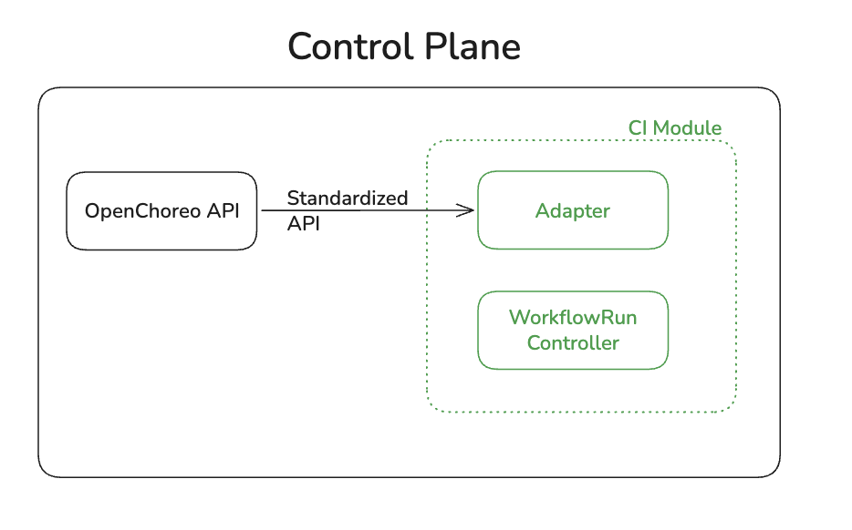
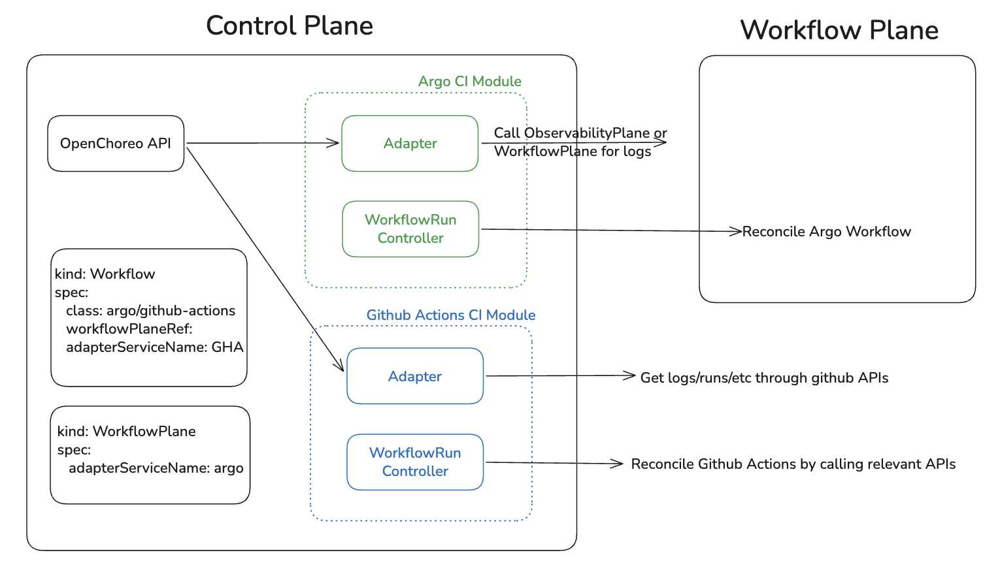

# Abstract OpenChoreo CI Module

## Problem

Right now, OpenChoreo only supports Argo Workflows for CI, and it's hardcoded throughout:

- The WorkflowRun controller directly uses Argo types and parses Argo-specific node names to figure out tasks.
- Logs and events are fetched by looking up pods that Argo created.
- There's no way to plug in a different CI engine without changing the core controller.

If we want to support something like GitHub Actions, Tekton, or Jenkins, we'd have to update the controller logic. That doesn't scale.

## What We Already Have

The `Workflow`/`ClusterWorkflow` CR's `runTemplate` field already accepts any arbitrary Kubernetes resource definition rendered via CEL templates. The template engine itself is CI-agnostic -- it evaluates expressions and produces a raw resource. So the rendering side is already CI-agnostic.

What's missing is the **runtime side** -- how we reconcile, monitor, and get information (logs, status, events) from whatever the template produced.

## Proposal

Introduce a **CI Module** abstraction that decouples the control plane from any specific CI engine.

### What's in a CI Module?



A CI module has two parts:

1. **WorkflowRun Controller** -- Knows how to reconcile workflow runs for a specific CI engine (e.g., create an Argo Workflow, trigger a GitHub Actions run, submit a Jenkins job). Each module ships its own controller that watches only the WorkflowRuns relevant to it.

2. **Adapter** -- Exposes a standardized API for retrieving logs, run status, events, and other operational data. The OpenChoreo API calls the adapter instead of directly querying engine-specific resources.

Multiple CI modules can be installed in the same control plane simultaneously.

### Module Configuration

External CI modules (GitHub Actions, Azure Pipelines, Jenkins, etc.) need engine-specific config to work -- API endpoints, auth tokens, organization names, and so on. Each module ships with its own config files and secrets, separate from the core platform.

For example:

- A **GitHub Actions module** would come with a config file specifying the GitHub API base URL (for GitHub Enterprise support) and a secret holding a personal access token or GitHub App credentials. Both the controller (to trigger workflow runs) and the adapter (to fetch logs and status) read from this config.
- An **Azure Pipelines module** would have its own config with the Azure DevOps organization URL and a PAT secret.
- A **Jenkins module** would need the Jenkins base URL and API credentials.

This config is bundled with the module's Helm chart (or whatever install mechanism the module uses) and lives in the same namespace as its controller and adapter. The core OpenChoreo platform doesn't need to know about it -- it just calls the adapter, and the adapter handles authentication with the upstream system.

K8s-native engines like Argo and Tekton don't strictly need this -- they talk to the local cluster API and reuse the existing workflow plane setup. But there's still value in storing things like a Git PAT in the control plane even for Argo: it would let us support features like listing commits, browsing branches, or showing PR status alongside the CI run -- things the workflow engine itself doesn't expose. So the config/secret mechanism should be available to all modules, not just external ones.

### Routing: How Workflows Find Their Module



Two new fields enable routing:

| Field | CR | Purpose |
|-------|-----|---------|
| `spec.class` | `Workflow` / `ClusterWorkflow` | Identifies which CI engine this workflow targets (e.g., `argo`, `tekton`, `github-actions`). Defined by the module author. Each WorkflowRun controller watches only runs whose resolved workflow matches its class. |
| `spec.adapterServiceName` | `WorkflowPlane` / `ClusterWorkflowPlane` | The Kubernetes service name of the adapter API for this plane. The OpenChoreo API uses this to route log/status/event requests to the correct adapter. |

**For non-Kubernetes-native engines** (e.g., GitHub Actions, Jenkins) that have no WorkflowPlane, the `adapterServiceName` field is also available on the `Workflow`/`ClusterWorkflow` CR as an override.

#### Example CRs

```yaml
# Argo-based workflow -- class tells the Argo module's controller to pick this up
kind: Workflow
metadata:
  name: build-and-push
spec:
  class: argo
  workflowPlaneRef:
    kind: ClusterWorkflowPlane
    name: default
  parameters:
    ocSchema:
      image: "string"
  runTemplate: ...  # Argo Workflow template
```

```yaml
# WorkflowPlane points to the Argo adapter service
kind: ClusterWorkflowPlane
metadata:
  name: default
spec:
  adapterServiceName: argo-ci-adapter
  planeID: production
  clusterAgent: ...
```

```yaml
# GitHub Actions workflow -- no WorkflowPlane, adapter on the Workflow itself
kind: ClusterWorkflow
metadata:
  name: gh-actions-ci
spec:
  class: github-actions
  adapterServiceName: github-actions-ci-adapter
  parameters:
    ocSchema:
      repository: "string"
      workflow_id: "string"
  runTemplate: ...  # Could be a lightweight CR or config for the GHA controller
```

### How It Works End-to-End

1. A `WorkflowRun` is created referencing a `Workflow` with `class: argo`.
2. The **Argo CI module's controller** (watching for `class: argo`) picks it up, renders the template, and applies the Argo Workflow to the workflow plane cluster.
3. The controller reconciles status, extracts tasks, and updates the WorkflowRun CR -- all using Argo-specific logic encapsulated within the module.
4. When the OpenChoreo API needs logs or status, it resolves the `adapterServiceName` from the WorkflowPlane (or Workflow) and calls the adapter's standardized API.
5. The adapter translates the request into engine-specific calls (e.g., fetch pod logs for WorkflowPlane/ObservabilityPlane, call GitHub API for GHA) and returns a unified response.

## Options

### Option 1: Pluggable CI Modules (proposed above)

**Pros:**
- Supports any CI engine -- Kubernetes-native (Argo, Tekton) and external (GitHub Actions, Jenkins, Azure Pipelines)
- Standardized adapter API enables consistent experience across CLI, MCP, and the OpenChoreo API for logs, status, and events
- Each module is independently deployable and maintainable
- If moving away from Backstage, current Jenkins/GitHub Actions support can migrate to this model
- Third-party module authors can extend the platform without modifying core code

**Cons:**
- More complex architecture
- Operators need to install and manage per-engine modules
- Breaking change from 1.0.0 -- Installation flow is now changed

### Option 2: Support only Kubernetes-native engines in-tree

Support k8s native tools (Argo and Tekton) in the workflow run controller. Other engines remain supported through Backstage (or similar).

**Pros:**
- Simpler architecture -- fewer moving parts, no adapter API to define
- Less operational overhead for users who only need Argo/Tekton

**Cons:**
- Not pluggable -- adding a new k8s native engine requires changes to the controller
- External engines (GitHub Actions, Jenkins) remain second-class with a different integration path

**Recommendation:** Option 1. The upfront complexity is manageable and pays off as the ecosystem grows.

## Questions

1. **WorkflowPlane for non-plane engines?** Today, WorkflowPlane only exists when there's a real cluster running the engine. Should we create a WorkflowPlane CR for engines like GitHub Actions just as a config? Or is the Workflow-level `adapterServiceName` override enough?

I do have a few questions on the design:

1. Why do we need an adapter? Our CR should be able to support any k8s-native workflow engine, right?
- Our CR do support any CR or any configurations. That is the runtime part, it is workflow engine agnostic.
- Adapter is needed to abstract out the API. Currently, UI just call openchoreo api server endpoints and doesn't call the workflow plane directly. Likewise, if we are to support any workflow engine whether it is k8s native or not, we need an abstract layer so the module itself will have the logic for handling how to get logs, how to get runs, etc. 
2. Do we need to go beyond backstage plugins for external CI? Eg. GitHub Actions
- That is a question that we need an answer. With option we can support workflow engines other than k8s native ones.
3. Logs should ideally be directly queried by the frontends as part of our design philosophy (whether it's the observability plane or an external API)
- With the adapter, UI does only need to call the adapter and it should handle how to get logs.
- if we hand over this to UI, it will have to support different workflow engines and configurations to access those APIs.
